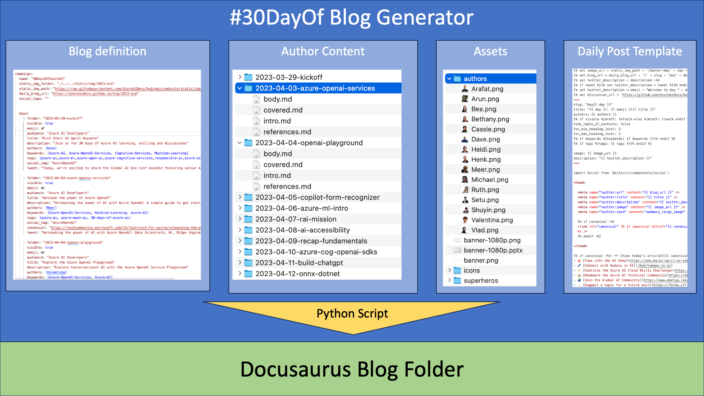
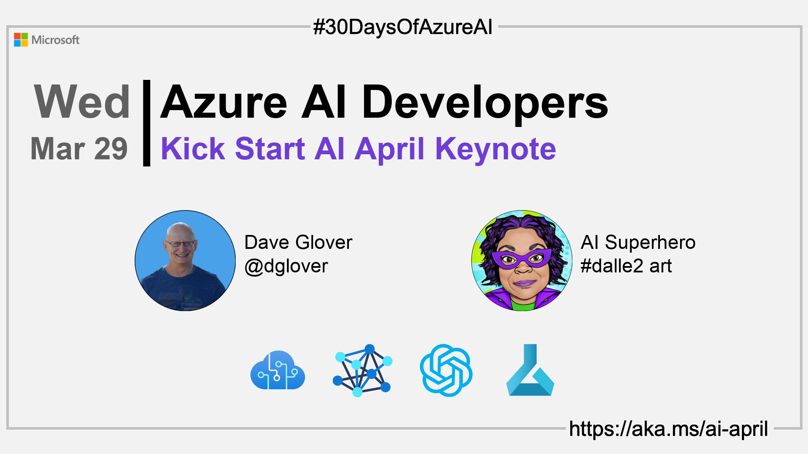

# 30DaysOf Blog Generator

The #30DaysOf Python generator simplifies the creation of the 30DaysOf blog posts for Docusaurus and makes it very easy to change the structure of the daily blog posts by hand which can be a very time-consuming task. 

The other main benefit is that content authors can focus on creating the content for the daily blog posts and not worry about the structure of the daily blog posts or the complexities of Docusaurus.


## 30DaysOf Generator Architecture

The 30DaysOf Generator is a Python script that uses the blog.yaml file to generate the blog posts. The blog.yaml file is used to configure the structure and the metadata of the blog posts.

Each daily post article is defined in the blog.yaml file. The order of the daily posts is defined in the blog.yaml. Having 30DaysOf blog structure defined in one place makes it easy to change the order of the daily blogs, and to add or remove daily posts. The blog.yaml file declares the following:
- Global metadata for the blog campaign.
- The daily posts metadata. The daily posts metadata is used to generate the daily posts. The most important metadata is the folder property. The folder property references the folder that contains the daily post content.

### The daily post content folder

The daily post content folder contains the following files:
- intro.md - The daily post introduction.
- covered.md - The daily post covered section.
- reference.md - The daily post reference section.
- body.md - The daily post body section.

### The assets folder

The assets folder contains various assets for the daily post. For example, product images, author images, and more.



### The daily blog template

The daily blog template is used to generate the daily blog posts. The daily blog template is a JinJar2 template. It defines the structure of the daily blog post. Having the daily blog post structure defined in a template makes it easy to change the structure of the daily blog post.

### The generator.py script

The generator.py script is a Python script that combines information from the blog.yaml file, the content and assets folders, and along with the blog template, generates the daily blog post structure for Docusaurus.

### Banner generation

The generator.py script will generate a banner for each daily blog post using the information from the blog.yaml file and image assets from the assets folder. Here is an example of a banner generated by the generator.py script.



## Content Configuration

Use VS Code with the [RedHat YAML](https://marketplace.visualstudio.com/items?itemName=redhat.vscode-yaml) extension installed to validate the blog.yaml file against the blog.json schema.

A blog.yaml file is used to configure the structure and the metadata of the blog posts. You'll find the blog.yaml file in the root of the project.

### Example blog.yaml

```yaml
# yaml-language-server: $schema=blog.json

campaign:
  name: "30DaysOfAzureAI"
  static_img_folder: "./../../static/img/2023-aia"
  static_img_path: "https://raw.githubusercontent.com/AzureAiDevs/hub/main/website/static/img/2023-aia"
  daily_blog_url: "https://azureaidevs.github.io/hub/2023-aia"
  social_tags: ""


  days:
    - folder: "2023-03-29-kickoff"
      visible: true
      emoji: 🚀
      audience: "Azure AI Developers"
      title: "Kick Start AI April Keynote"
      description: "Join us for 30 Days Of Azure AI learning, skilling and discussions"
      authors: [Dave]
      keywords: [Azure-AI, Azure-OpenAI-Services, Cognitive-Services, Machine-Learning]
      tags: [azure-ai,azure-ml,azure-open-ai,azure-cognitive-services,responsible-ai,azure-ai-fundamentals,30-days-of-azure-ai]
      social_tag: "AzureOpenAI"
      tweet: "Today, we're excited to share the Global AI Dev Conf keynote featuring senior Azure AI leaders John Montgomery and Bob Breynaert discussing the future of AI."

    - folder: "2023-04-03-azure-openai-services"
      visible: true
      emoji: 🏁
      audience: "Azure AI Developers"
      title: "Unleash the power of Azure OpenAI"
      description: "Unleashing the power of AI with Azure OpenAI: A simple guide to get started"
      authors: [Meer]
      keywords: [Azure-OpenAI-Services, Machine-Learning, Azure-AI]
      tags: [azure-ai, azure-open-ai, 30-days-of-azure-ai]
      social_tag: "AzureOpenAI"
      canonical: "https://techcommunity.microsoft.com/t5/fasttrack-for-azure/unleashing-the-power-of-ai-with-azure-openai-a-simple-guide-to/ba-p/3725706?WT.mc_id=aiml-89446-dglover"
      tweet: "Unleashing the power of AI with Azure OpenAI! Data Scientists, ML, MLOps Engineers, or App Developers, this for you. We'll cover large-scale generative AI models, code generation, and DALL-E 2"

```

## Workflow

1. Clone the 30_days_blog_generator repo `git clone https://github.com/AzureAiDevs/30_days_blog_generator.git`
2. Delete the .git folder, and then initialize a new git repo. `rm -rf .git` then `git init`
3. Update the blog.yaml file with the new blog campaign name. For example, 2023-swa and update the daily blog metadata.
4. Run the generator.py script to generate the blog posts. 
   1. If the daily blog content folder doesn't exists, the generator will create a empty folder structure ready for the content authors to update.
   2. The generator will create the Docusaurus blog post structure for each daily blog post.

## Installation

Tested on:

1. macOS (Venture)
1. Windows 11 on Intel and Windows 11 on ARM
1. Ubuntu 20.04/22.04 on Intel and ARM.

```bash
pip3 install -r requirements.txt
```

## Usage

Run the generator.py script to generate the blog posts. It will create a folder for each day in the output directory.

1. The generator will validate the blog.yaml file and will fail if the file is not valid.
1. Pass the generator the path to the Docusaurus website folder and the content folder name.

    - -w is the path to the Docusaurus website folder. For example, /Users/dave/GitHub/AzureAiDevelopers/hub/website
    - -c is the content folder name. For example, 2023-aia

1. Blog items are stored in the `website/<content_name>` folder.
1. Blog item banners are stored in the `website/static/img/<content_name>` folder.

```bash
python3 generator.py -w "/Users/dave/GitHub/AzureAiDevelopers/hub/website" -c "2023-aia"
```

<!-- ### Optional parameters


If you wish to update a blog item, then specify the folder name defined in the blogs.yaml file.

```bash
python3 generator.py -f "2023-04-04-openai-playground"
``` -->


<!-- ### Convert Blog.yaml to JSON

```bash
python3 -c 'import sys, oyaml as yaml, json; json.dump (yaml.load (sys.stdin, Loader=yaml.Loader), sys.stdout, indent=4)' < blog.yaml > tweets.json
``` -->

## Understanding the blog.yaml file

The blog.yaml file is used to configure the structure and the metadata of the blog posts. You'll find the blog.yaml file in the root of the project.

The following sections describe the blog.yaml file.

### Global metadata

| Property | Description |
| --- | --- |
| name | The name of the blog campaign. For example, `30DaysOfAzureAI` |
| static_img_folder | This is the path to the Docusaurus static images folder. |
| static_img_path | This is the url path used when sharing daily banner posts on social media. For example, https://raw.githubusercontent.com/AzureAiDevs/hub/main/website/static/img/2023-aia |
| daily_blog_url | The URL to the daily blog posts. The url is used when sharing blogs via social media. For example, https://azureaidevs.github.io/hub/2023-aia |
| social_tags | The social tags for the blog campaign. For example, `30DaysOfAzureAI` |

### Daily blog metadata

| Property | Description |
| --- | --- |
| folder | The folder name for the daily blog post. For example, `2023-04-03-azure-openai-services` |
| visible | Set to `true` to generate the daily blog post. |
| emoji | The emoji for the daily blog post. For example, `🏁` |
| audience | The audience for the daily blog post. For example, `Azure AI Developers` |
| title | The title for the daily blog post. For example, `Unleash the power of Azure OpenAI` |
| description | The description for the daily blog post. For example, `Unleashing the power of AI with Azure OpenAI: A simple guide to get started` |
| authors | The authors for the daily blog post. For example, `[Meer]`. You can specify more than one author, for example, `[Meer, Dave]`  |
| keywords | The keywords are used to reference the product image icons from the `assets/icons` folder. For example, `[Azure-OpenAI-Services, Machine-Learning, Azure-AI]` will add .pngs for each of the names listed.|
| tags | The tags for the daily blog post. For example, `[azure-ai, azure-open-ai, 30-days-of-azure-ai]` |
| social_tag | The social tag for the daily blog post. For example, `AzureOpenAI` |
| canonical | The canonical URL for the daily blog post. For example, `https://techcommunity.microsoft.com/t5/fasttrack-for-azure/unleashing-the-power-of-ai-with-azure-openai-a-simple-guide-to/ba-p/3725706?WT.mc_id=aiml-89446-dglover` |
| tweet | The tweet for the daily blog post. For example, `Unleashing the power of AI with Azure OpenAI! Data Scientists, ML, MLOps Engineers, or App Developers, this for you. We'll cover large-scale generative AI models, code generation, and DALL-E 2` |

## Including Videos

In the .md file add the following:

```markdown
import ReactPlayer from 'react-player'

// Render a YouTube video player
<ReactPlayer url='https://www.youtube.com/watch?v=ysz5S6PUM-U' />
```

## Azure Service Icons

The [Azure architecture icons](https://learn.microsoft.com/en-us/azure/architecture/icons/) link provides an excellent source of high quality Azure icons in SVG format.

You will need to convert the SVG to PNG format. I use the [Inkscape](https://inkscape.org/) application to convert the SVG to PNG format. It's available for Windows, macOS, and Linux. It's a free, open-source, and an excellent app for batch converting SVG to PNG format. 

### Converting SVG to PNG format

From a terminal window, navigate to the folder containing the .svg files, start `bash`, then run the following command to convert the SVG to PNG format. This command will convert all the SVG files in the current folder to PNG format with a uniform height of 130 pixels.

```bash
for f in *.svg; do inkscape "$f" -d 300 -h 130 -o "${f%.*}.png"; done
```

## Author Images

The author images are stored in the `assets/authors` folder. The author images are used to generate the daily blog post banners. Ideally the author images should be at least 300x300 pixels. The images are downscaled to 240x240 pixels by the generator.py script.

### Removing the background from author images

On macOS, use the built in image background remover. The easiest way to remove the images from a batch of images is to use `Quick Actions`.

1. Select all the images in the folder from Finder.
2. Right click on the images, select `Quick Actions` and then `Remove Background`.
